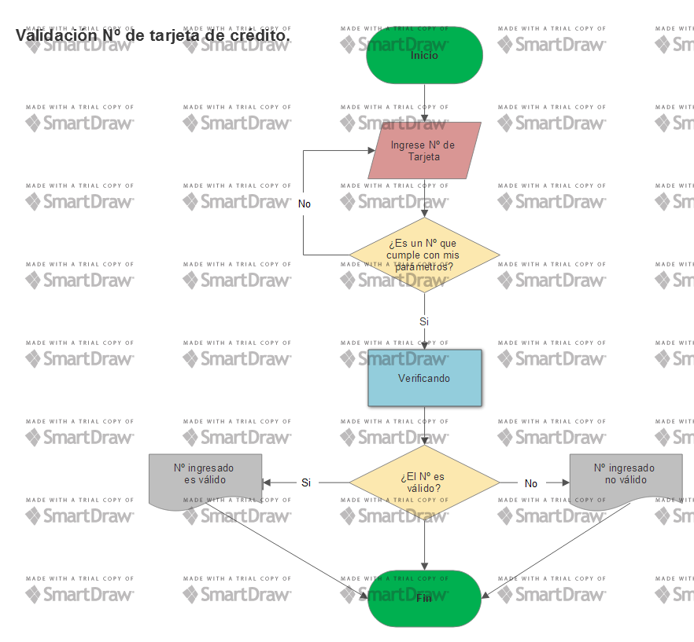

PSEUDOCÓDIGO
Creamos un programa para determinar la validez del número de la tarjeta de crédito a ingresar, mediante una función "isValidCard".
A continuación el usuario procede a ingresar los datos. Dependiendo de lo que ingrese, nuestro código irá accionando:
	-Si ingresa el campo vacío o ingresa letras, retornará la alerta "Ingrese un número válido".
	-En caso contrario, si el usuario ingresa números, el código seguirá accionando para determinar si el número es válido o no.

DIAGRAMA DE FLUJO
